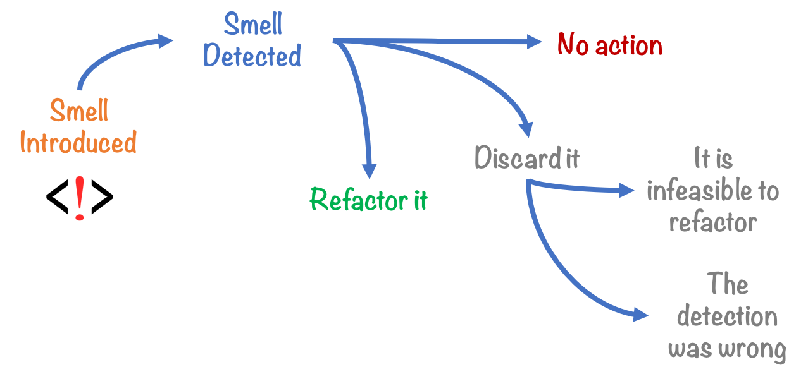

# STA 523 :: Homework 2

## Introduction

Writing clean and elegant code is more that just following a specific style. It
involves a continuous work flow of rewriting, restructuring, and rethinking how
your code functions. Homework 2 will get you started in the journey of
developing code that smells good.

## Tasks

### Part I

Tasks 1 and 2 will give you some more background information and prepare you
to successfully complete Part II.

#### Task 1

- Read sections [13.1 - 13.4](https://adv-r.hadley.nz/s3.html) in Advanced R by
  Hadley Wickham.

- Watch [Code Smells and Feels](https://www.youtube.com/watch?v=7oyiPBjLAWY) by
  Jenny Bryan. Her slides and related materials are available on GitHub
  [here](https://github.com/jennybc/code-smells-and-feels).

#### Task 2

As a team, agree on a common coding style. Refresh yourself with the code style
resources provided in Homework 1.

### Part II

Read through Tasks 3 - 6 to get an idea of Part II's purpose. As a point of
reference, one working example for inspiration of an S3 class is given by the
"Roman" class. See  `?utils::as.roman()`.

#### Task 3

Create a new class for the S3 OOP system. For your class, include constructor,
validator, and helper functions as explained in section 13.3 of
<i>Advanced R</i>.

#### Task 4

Create three methods for your newly defined
class in Task 3. These methods should either
use existing generic functions such as `print()`, `summary()`, `plot()`, etc; or
you may create a new generic function. Function `sloop::is_S3_generic()` can
help you identify which `base` R functions are S3 generics.

#### Task 5

Demonstrate your class and methods with two examples for each method.

#### Task 6

Provide a brief write-up that explains your class and methods.

## Essential details

### Deadline and submission

**The deadline to submit Homework 2 is Wednesday, September 9 at 11:59pm EST.**
Only your final commit and code in the master branch will be graded.
To submit, push your work to your assigned team repository on GitHub before
the deadline.

### Help

- Post your questions in the #hw2 channel on Slack. Explain your error / problem
  in as much detail as possible or give a reproducible example that generates
  the same error. Make use of the code snippet option available in Slack. You
  may also send a direct message to myself or the TAs.

- Visit the instructor or TAs in Zoom office hours.

- The instructor and TAs will not answer any questions about this assignment
 	within six hours of the deadline.

### Academic integrity

This is a team assignment. You may communicate with other teams in the
course. As a reminder, any code you use directly or as inspiration must be 
cited.

To uphold the Duke Community Standard:

- I will not lie, cheat, or steal in my academic endeavors;
- I will conduct myself honorably in all my endeavors; and
- I will act if the Standard is compromised.

Duke University is a community dedicated to scholarship, leadership, and
service and to the principles of honesty, fairness, respect, and accountability.
Citizens of this community commit to reflect upon and uphold these principles in
all academic and non-academic endeavors, and to protect and promote a culture of
integrity. Cheating on exams and quizzes, plagiarism on homework assignments and
projects, lying about an illness or absence and other forms of academic
dishonesty are a breach of trust with classmates and faculty, violate the Duke
Community Standard, and will not be tolerated. Such incidences will result in a
0 grade for all parties involved as well as being reported to the University
Judicial Board. Additionally, there may be penalties to your final class grade.
Please review Duke’s Standards of Conduct.

### Grading

| **Topic**                                        | **Points** |
|--------------------------------------------------|-----------:|
| Task 3                                           |          9 |
| Task 4                                           |          6 |
| Task 5                                           |          4 |
| Task 6                                           |          4 |
| at least 1 pull request / commit per team member |          3 |
| Code style and format                            |          3 |
| Named R code chunks                              |          1 |
| **Total**                                        |     **30** |

*Documents that fail to knit after minimal intervention will receive a 0*.

## References

1. jennybc/code-smells-and-feels. (2020). GitHub.
   https://github.com/jennybc/code-smells-and-feels

2. Wickham, H. (2020). 13 S3 | Advanced R. Adv-r.hadley.nz.
   https://adv-r.hadley.nz/s3.html
